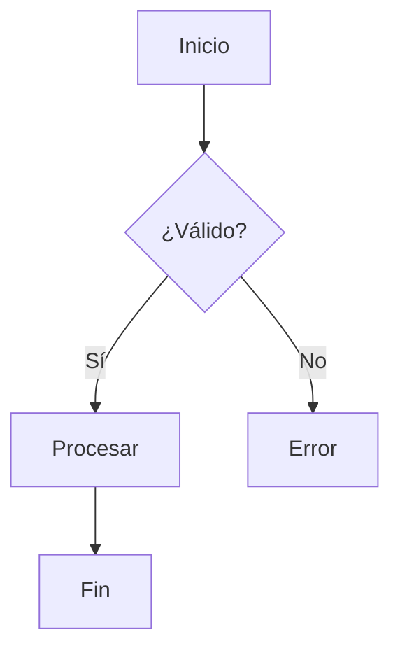
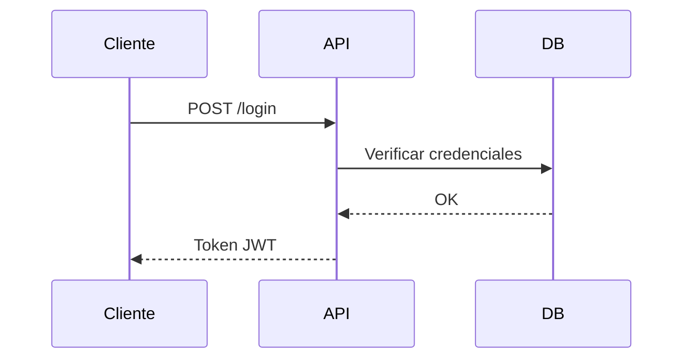
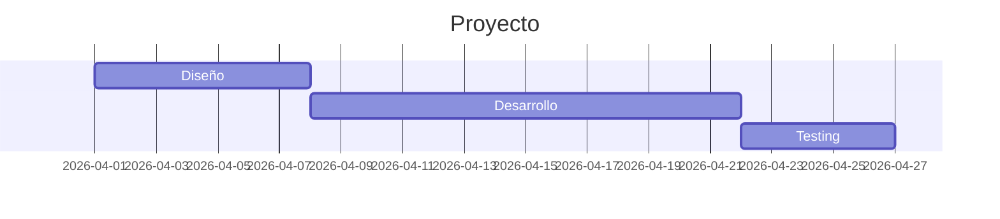
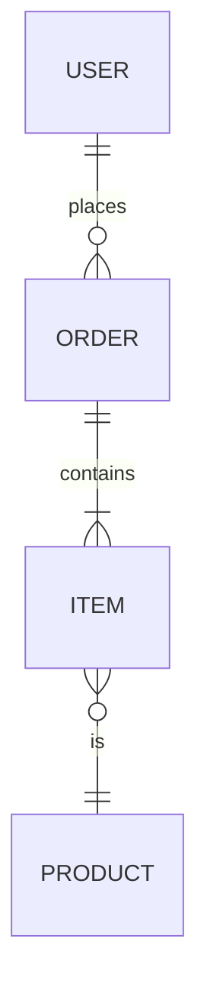
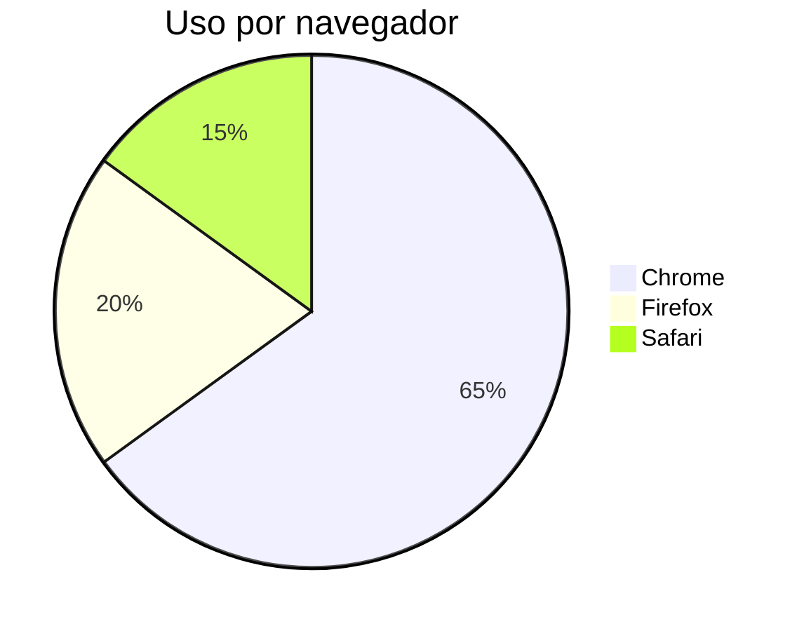
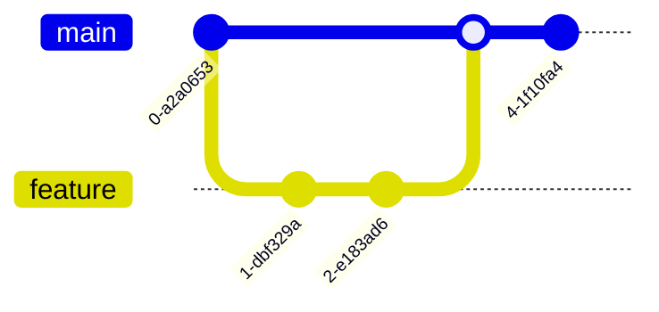

# Mermaid Examples

## Flowchart

```mermaid
graph TD
    A[Inicio] --> B{¿Válido?}
    B -->|Sí| C[Procesar]
    B -->|No| D[Error]
    C --> E[Fin]
```

## Sequence

```mermaid
sequenceDiagram
    Cliente->>API: POST /login
    API->>DB: Verificar credenciales
    DB-->>API: OK
    API-->>Cliente: Token JWT
```

## Gantt

```mermaid
gantt
    title Proyecto
    dateFormat YYYY-MM-DD
    Diseño :a1, 2026-04-01, 7d
    Desarrollo :a2, after a1, 14d
    Testing :a3, after a2, 5d
```

## ER Diagram

```mermaid
erDiagram
    USER ||--o{ ORDER : places
    ORDER ||--|{ ITEM : contains
    ITEM }o--|| PRODUCT : is
```

## Pie Chart

```mermaid
pie title Uso por navegador
    "Chrome" : 65
    "Firefox" : 20
    "Safari" : 15
```

## Git Graph

```mermaid
gitGraph
    commit
    branch feature
    commit
    commit
    checkout main
    merge feature
    commit
```
